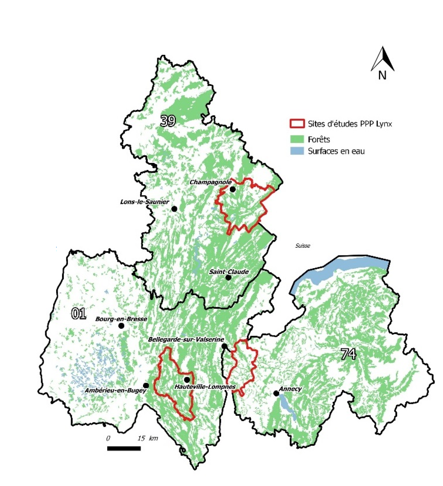

class: center, middle
background-image: url(img/illustration1bis.jpg)
background-size: cover 
<br>
# First steps in Deep Learning
## Species identification and camera traps

.large[Olivier Gimenez [`r icon::fa_twitter()`](https://twitter.com/oaggimenez) [`r icon::fa_github()`](https://github.com/oliviergimenez) | Imaginecology conference [`r icon::fa("home")`](https://imaginecology.sciencesconf.org/)] 

.footnote[
`r icon::fa("camera")` Alain Laurent & David Hackel]

```{r setup, include=FALSE}
options(htmltools.dir.version = FALSE)
```

```{r xaringan-themer, include=FALSE, warning=FALSE}
library(xaringanthemer)
style_duo(primary_color = "#1F4257", secondary_color = "#F97B64")
```

---
class: inverse, center, bottom
background-image: url(img/grabbytheballs.jpg)
background-size: cover 

## Predator-prey interactions

---
class: center, middle
background-image: url(img/juramountains.jpg)
background-size: cover 

<br><br><br><br><br><br><br>

<li>Joint work w/ Anna Chaine, Maëlis Kervellec, OFB and Ain/Jura Hunting Associations
<li>How do environmental factors affect lynx and its preys chamois and roe deer in the French Jura mountains?

.footnote[
`r icon::fa("camera")` [Peter Bucks](https://twitter.com/peterbucks)]

---
class: left, bottom
background-image: url(img/cameratraps.jpg)
background-size: cover 

## Camera traps
* Non-invasive monitoring. Amazing developments. 
* Problem: gigas of pix to tag by hand. 

.footnote[
`r icon::fa("camera")` [Tiard Schulz](https://tiard-schulz-fotografie.jimdosite.com/)]


---
class: center, top
background-image: url(https://miro.medium.com/max/3840/1*oB3S5yHHhvougJkPXuc8og.gif)
background-size: contain 
<!-- # Deep learning -->
<!-- * Je suis curieux. J'aime comprendre. J'aime bcp R.  -->

.footnote[
Source: [Andrew Ng](https://en.wikipedia.org/wiki/Andrew_Ng)]

---
class: center, top
background-image: url(img/imaginecology.png)
background-size: contain 
## <https://ecostat.gitlab.io/imaginecology/>

---
class: center, middle
## [imaginecology](https://ecostat.gitlab.io/imaginecology/)

* Basics of DL w/ a glossary; Papers, codes and datasets for training your models; How-to tutorials; Kuddos Vincent et Gaspard

* I used [tuto 5: 
Detection of animals on camera trap images with RetinaNet](https://gitlab.com/ecostat/imaginecology/-/tree/master/projects/cameraTrapDetectionWithRetinanet/)

* Check out <https://github.com/oliviergimenez/DLcamtrap>

* RetinaNet (detect, and classify): RetinaNet is a single-stage object detector : for each known object on an image it can predict a class, a bounding box (a square containing the object) and a confidence score.

---
class: inverse, right, top
background-image: url(https://blog.nationalgeographic.org/wp-content/uploads/2013/08/01-Snapshot-originals-3-Slide61.gif)
background-size: cover 

## Results?


---
class: inverse, center, middle

## Transfer training w/ a site in Jura county

---
class: center, middle
background-image: url(img/lynxplusprey.png)
background-size: contain 

---
class: center, middle
background-image: url(img/others.png)
background-size: contain 

---
class: center, middle

## Validation in another site in Ain county

```{r, message = FALSE, warning = FALSE, echo = FALSE, comment = ""}
library(tidyverse)
library(gt)
dat <- tribble(
~species, ~trueP, ~falseP, ~falseN,
"badgers", 535, 123, 41,
"chamois", 70, 456, 2,
"wild cat", 95, 45, 25,
"roe deer", 872, 65, 229,
"hare", 0, 129, 0,
"lynx", 193, 7, 10,
"fox", 786, 54, 136,
"wild boar", 579, 170, 64,
"deer", 3, 68, 21)
dat %>% 
  gt() %>%
  cols_align(align = "center", 
             columns = vars(trueP, falseP, falseN)) %>%
  tab_style(
    style = list(
      cell_borders(
        sides = "bottom",
        color = "white"),
      cell_fill(color = "#1F4257"),
      cell_text(weight = "bold")),
    locations = cells_body(
      columns = everything()))
```

---
class: center, middle
background-image: url(https://media.giphy.com/media/j4rPM934CLIvC/giphy.gif)
background-size: cover 

---
class: inverse, center, middle
# Lessons learnt

---

.pull-left[

### Terminology is tricky

* [imaginecology](https://ecostat.gitlab.io/imaginecology/basics.html) glossary 

* [Statistical view](https://www.stat.colostate.edu/~jah/talks_public_html/isec2020/index.html) by Jennifer Hoeting


]

.pull-right[
]


---

.pull-left[

### Terminology is tricky

* [imaginecology](https://ecostat.gitlab.io/imaginecology/basics.html) glossary 

* [Statistical view](https://www.stat.colostate.edu/~jah/talks_public_html/isec2020/index.html) by Jennifer Hoeting

### Questioning

* Reproducibility?

* Legal and ethical issues?

* Carbon footprint of DL?


]

.pull-right[
]


---

.pull-left[

### Terminology is tricky

* [imaginecology](https://ecostat.gitlab.io/imaginecology/basics.html) glossary 

* [Statistical view](https://www.stat.colostate.edu/~jah/talks_public_html/isec2020/index.html) by Jennifer Hoeting

### Questioning

* Reproducibility?

* Legal and ethical issues?

* Carbon footprint of DL?

### Navigate the jungle?

* Learn from the [pro](https://www.kaggle.com/c/iwildcam-2020-fgvc7/overview)

* Follow [S. Beery](https://twitter.com/sarameghanbeery) and [M. Tabak](https://twitter.com/Mikey_QSC)


]

.pull-right[
]


---

.pull-left[

### Terminology is tricky

* [imaginecology](https://ecostat.gitlab.io/imaginecology/basics.html) glossary 

* [Statistical view](https://www.stat.colostate.edu/~jah/talks_public_html/isec2020/index.html) by Jennifer Hoeting

### Questioning

* Reproducibility?

* Legal and ethical issues?

* Carbon footprint of DL?

### Navigate the jungle?

* Learn from the [pro](https://www.kaggle.com/c/iwildcam-2020-fgvc7/overview)

* Follow [S. Beery](https://twitter.com/sarameghanbeery) and [M. Tabak](https://twitter.com/Mikey_QSC)


]

.pull-right[
```{r echo = FALSE}
library(tweetrmd)
include_tweet("https://twitter.com/oaggimenez/status/1325079735500759042", align = "right", maxwidth = 360)
```
]


---
class: center, middle
background-image: url(img/illustration1.jpg)
background-size: cover 
## [Mieux connaître le lynx boréal grâce à l'écologie statistique](https://theconversation.com/mieux-connaitre-le-lynx-boreal-grace-a-lecologie-statistique-147241)


.footnote[
`r icon::fa("camera")` Sylvain Gatti]


---
# Study site

.pull-left[

]

.pull-right[

]


---
class: center, middle
background-image: url(img/lynx_kittens.JPG)
background-size: cover 


---
class: center, middle
background-image: url(img/ethics.png)
background-size: cover 


---
class: center, middle
background-image: url(img/predictions.jpg)
background-size: cover 


---
class: center, middle
background-image: url(img/lynx_mulot.JPG)
background-size: cover 


---
class: center, middle
background-image: url(img/superlynx.JPG)
background-size: cover 


---
class: center, middle
background-image: url(img/lynxtrap.JPG)
background-size: cover 

