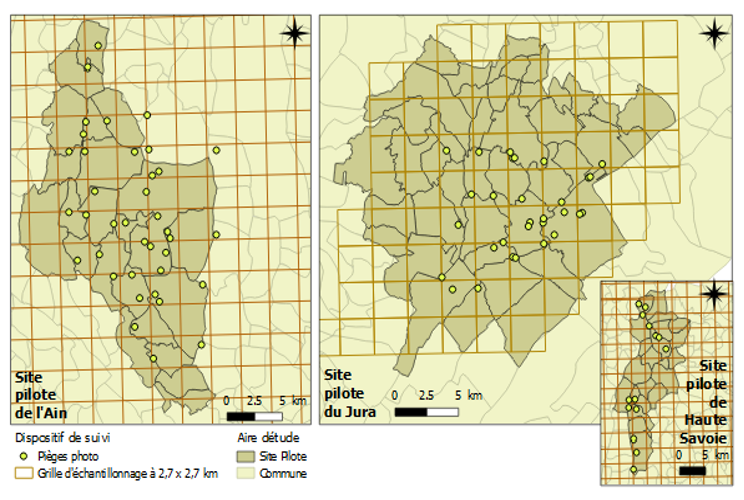

class: center, middle
background-image: url(img/illustration1bis.jpg)
background-size: cover 
<br>
# First steps in Deep Learning
## Species identification and camera traps

.large[Olivier Gimenez [`r icon::fa_twitter()`](https://twitter.com/oaggimenez) [`r icon::fa_github()`](https://github.com/oliviergimenez) | Imaginecology conference [`r icon::fa("home")`](https://imaginecology.sciencesconf.org/)] 

.footnote[
`r icon::fa("camera")` Alain Laurent & David Hackel]

```{r setup, include=FALSE}
options(htmltools.dir.version = FALSE)
```

```{r xaringan-themer, include=FALSE, warning=FALSE}
library(xaringanthemer)
style_duo(primary_color = "#1F4257", secondary_color = "#F97B64")
```

---
class: inverse, left, top
background-image: url(img/grabbytheballs.jpg)
background-size: cover 

## Predator-prey interactions

.footnote[
`r icon::fa("camera")`[Sarah Skinner](https://www.comedywildlifephoto.com/gallery/finalists/2019_finalists.php)]

---
class: left, middle
background-image: url(img/juramountains.jpg)
background-size: cover 

<br><br><br><br><br><br><br><br><br><br>

<li>Coll. A. Chaine, M. Kervellec, V. Mielle, [OFB](https://ofb.gouv.fr/) and Ain/Jura hunting associations
<li>How do environmental factors affect lynx and its preys ?

.footnote[
`r icon::fa("camera")` [Peter Bucks](https://twitter.com/peterbucks)]


---
class: left, middle
background-image: url(img/cameratraps.jpg)
background-size: cover 

<br><br><br>

## Camera traps

.footnote[
`r icon::fa("camera")` [Tiard Schulz](https://tiard-schulz-fotografie.jimdosite.com/)]


---
class: left, top
background-image: url(img/lynx_kittens.JPG)
background-size: cover


--

* Non-invasive monitoring

--

* Gigas of pix to tag by hand

--

* Deep learning?

---
class: center, middle
background-image: url(https://miro.medium.com/max/3840/1*oB3S5yHHhvougJkPXuc8og.gif)
background-size: contain 
<!-- * Je suis curieux. J'aime comprendre. J'aime bcp R.  -->

.footnote[
Source: [Andrew Ng](https://en.wikipedia.org/wiki/Andrew_Ng)]

---
class: center, top
background-image: url(img/imaginecology.png)
background-size: contain 
## <https://ecostat.gitlab.io/imaginecology/>

<br><br><br><br><br><br><br><br><br><br><br><br><br>

#### Kuddos to [Vincent Miele](https://lbbe.univ-lyon1.fr/-Miele-Vincent-.html) and [Gaspard Dussert](https://www.linkedin.com/in/gaspard-dussert/?originalSubdomain=fr) !

---
class: right, top
background-image: url(img/illustration1.jpg)
background-size: cover 

.footnote[
`r icon::fa("camera")` [Sylvain Gatti](https://www.linkedin.com/in/sylvaingatti/?locale=fr_FR)]

--

I used the how-to guide on [detection of animals on camera trap images](https://gitlab.com/ecostat/imaginecology/-/tree/master/projects/cameraTrapDetectionWithRetinanet/)

--

[RetinaNet](https://arxiv.org/pdf/1708.02002.pdf) for detecting and classifying

--

Check out [my workflow](https://github.com/oliviergimenez/DLcamtrap)


<!-- RetinaNet is a single-stage object detector : for each known object on an image it can predict a class, a bounding box (a square containing the object) and a confidence score. -->

---
class: left, top
background-image: url(https://thumbs.gfycat.com/FreeThoughtfulJumpingbean-size_restricted.gif)
background-size: cover 

---
class: inverse, right, top
background-image: url(https://blog.nationalgeographic.org/wp-content/uploads/2013/08/01-Snapshot-originals-3-Slide61.gif)
background-size: cover 

## Results?


---
class: inverse, center, middle

## Transfer learning on a site (Jura)

---
class: center, middle
background-image: url(img/lynxplusprey.png)
background-size: contain 

---
class: center, middle
background-image: url(img/others.png)
background-size: contain 

---
class: inverse, center, middle

## Automatic tagging in another site (Ain)

---
class: inverse, center, middle

```{r, message = FALSE, warning = FALSE, echo = FALSE, comment = ""}
library(tidyverse)
library(gt)
dat <- tribble(
~species, ~trueP, ~falseP, ~falseN,
"badgers", 535, 123, 41,
"chamois", 70, 456, 2,
"wild cat", 95, 45, 25,
"roe deer", 872, 65, 229,
"hare", 0, 129, 0,
"lynx", 193, 7, 10,
"fox", 786, 54, 136,
"wild boar", 579, 170, 64,
"deer", 3, 68, 21)
dat %>% 
  gt() %>%
  cols_align(align = "center", 
             columns = vars(trueP, falseP, falseN)) %>%
  tab_style(
    style = list(
      cell_borders(
        sides = "bottom",
        color = "white"),
      cell_fill(color = "#F97B64"),
      cell_text(weight = "bold")),
    locations = cells_body(
      columns = everything())) %>%
  tab_options(
    table.width = pct(100),
    column_labels.background.color = "#1F4257",
      column_labels.font.weight = "bold"
  )
```

---
class: inverse, center, middle

```{r, message = FALSE, warning = FALSE, echo = FALSE, comment = ""}
library(tidyverse)
library(gt)
dat <- tribble(
~species, ~trueP, ~falseP, ~falseN,
"badgers", 535, 123, 41,
"chamois", 70, 456, 2,
"wild cat", 95, 45, 25,
"roe deer", 872, 65, 229,
"hare", 0, 129, 0,
"lynx", 193, 7, 10,
"fox", 786, 54, 136,
"wild boar", 579, 170, 64,
"deer", 3, 68, 21)
dat %>% 
  gt() %>%
  cols_align(align = "center", 
             columns = vars(trueP, falseP, falseN)) %>%
  tab_style(
    style = list(
      cell_borders(
        sides = "bottom",
        color = "white"),
      cell_fill(color = "#F97B64"),
      cell_text(weight = "bold")),
    locations = cells_body(
      columns = everything())) %>%
  tab_style(
    style = list(
      cell_fill(color = "#4bd9a0")),
    locations = cells_body(rows = c(2, 4,6))) %>%
  tab_options(
    table.width = pct(100),
    column_labels.background.color = "#1F4257",
    column_labels.font.weight = "bold"
  )
```


---
class: center, middle
background-image: url(https://media.giphy.com/media/j4rPM934CLIvC/giphy.gif)
background-size: cover 

---
class: inverse, center, middle
background-image: url(https://www.tennislegend.fr/gif/zzS0DOD26.gif)
background-size: contain

---
class: left, top
background-image: url(https://media.giphy.com/media/3o7btPCcdNniyf0ArS/giphy.gif)
background-size: cover

--

### Generalisation to another site is challenging

--

### Lack of diversity in training dataset

--

--

### Pool both sites, and redo


---
class: inverse, center, middle
# Lessons learned


---

.pull-left[

### Terminology is tricky


]

.pull-right[
]

---

.pull-left[

### Terminology is tricky

* [imaginecology](https://ecostat.gitlab.io/imaginecology/basics.html) glossary 


]

.pull-right[

]

---

.pull-left[

### Terminology is tricky

* [imaginecology](https://ecostat.gitlab.io/imaginecology/basics.html) glossary 

* [Statistical view](https://www.stat.colostate.edu/~jah/talks_public_html/isec2020/index.html) by Jennifer Hoeting


]

.pull-right[<br><br><br><br><br>

]


---

.pull-left[

### Terminology is tricky

* [imaginecology](https://ecostat.gitlab.io/imaginecology/basics.html) glossary 

* [Statistical view](https://www.stat.colostate.edu/~jah/talks_public_html/isec2020/index.html) by Jennifer Hoeting

### What about


]

.pull-right[
]

---

.pull-left[

### Terminology is tricky

* [imaginecology](https://ecostat.gitlab.io/imaginecology/basics.html) glossary 

* [Statistical view](https://www.stat.colostate.edu/~jah/talks_public_html/isec2020/index.html) by Jennifer Hoeting

### What about

* Reproducibility?


]

.pull-right[<br><br><br><br><br><br><br><br><br><br><br>

]


---

.pull-left[

### Terminology is tricky

* [imaginecology](https://ecostat.gitlab.io/imaginecology/basics.html) glossary 

* [Statistical view](https://www.stat.colostate.edu/~jah/talks_public_html/isec2020/index.html) by Jennifer Hoeting

### What about

* Reproducibility?

* Legal and ethical issues?


]

.pull-right[<br><br><br><br><br><br><br><br><br><br><br><br>

]


---

.pull-left[

### Terminology is tricky

* [imaginecology](https://ecostat.gitlab.io/imaginecology/basics.html) glossary 

* [Statistical view](https://www.stat.colostate.edu/~jah/talks_public_html/isec2020/index.html) by Jennifer Hoeting

### What about

* Reproducibility?

* Legal and ethical issues?

* Carbon footprint?


]

.pull-right[<br><br><br><br><br><br><br><br><br><br><br><br>

]


---

.pull-left[

### Terminology is tricky

* [imaginecology](https://ecostat.gitlab.io/imaginecology/basics.html) glossary 

* [Statistical view](https://www.stat.colostate.edu/~jah/talks_public_html/isec2020/index.html) by Jennifer Hoeting

### What about

* Reproducibility?

* Legal and ethical issues?

* Carbon footprint?

### Ask the experts


]

.pull-right[
]

---

.pull-left[

### Terminology is tricky

* [imaginecology](https://ecostat.gitlab.io/imaginecology/basics.html) glossary 

* [Statistical view](https://www.stat.colostate.edu/~jah/talks_public_html/isec2020/index.html) by Jennifer Hoeting

### What about

* Reproducibility?

* Legal and ethical issues?

* Carbon footprint?

### Ask the experts

* [iWildCam](https://www.kaggle.com/c/iwildcam-2020-fgvc7/overview) competition


]

.pull-right[<br><br><br><br><br><br><br><br><br><br><br><br>

]


---

.pull-left[

### Terminology is tricky

* [imaginecology](https://ecostat.gitlab.io/imaginecology/basics.html) glossary 

* [Statistical view](https://www.stat.colostate.edu/~jah/talks_public_html/isec2020/index.html) by Jennifer Hoeting

### What about

* Reproducibility?

* Legal and ethical issues?

* Carbon footprint?

### Ask the experts

* [iWildCam](https://www.kaggle.com/c/iwildcam-2020-fgvc7/overview) competition

* Follow [S. Beery](https://twitter.com/sarameghanbeery) and [M. Tabak](https://twitter.com/Mikey_QSC)


]

.pull-right[]


---

.pull-left[

### Terminology is tricky

* [imaginecology](https://ecostat.gitlab.io/imaginecology/basics.html) glossary 

* [Statistical view](https://www.stat.colostate.edu/~jah/talks_public_html/isec2020/index.html) by Jennifer Hoeting

### What about

* Reproducibility?

* Legal and ethical issues?

* Carbon footprint?

### Ask the experts

* [iWildCam](https://www.kaggle.com/c/iwildcam-2020-fgvc7/overview) competition

* Follow [S. Beery](https://twitter.com/sarameghanbeery) and [M. Tabak](https://twitter.com/Mikey_QSC)


]

.pull-right[
```{r echo = FALSE}
library(tweetrmd)
include_tweet("https://twitter.com/oaggimenez/status/1325079735500759042", align = "right", maxwidth = 360)
```
]


---
class: center, bottom
background-image: url(img/predictions.jpg)
background-size: cover 

.footnote[
Thank you!
]


---
class: right, top
background-image: url(img/the_conversation.png)
background-size: cover 
#### <https://bit.ly/3ezfaIy>


<!-- --- -->
<!-- # Study site  -->

<!-- .pull-left[ -->
<!--  -->
<!-- ] -->

<!-- .pull-right[ -->
<!--  -->
<!-- ] -->

